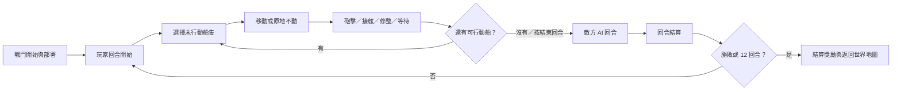
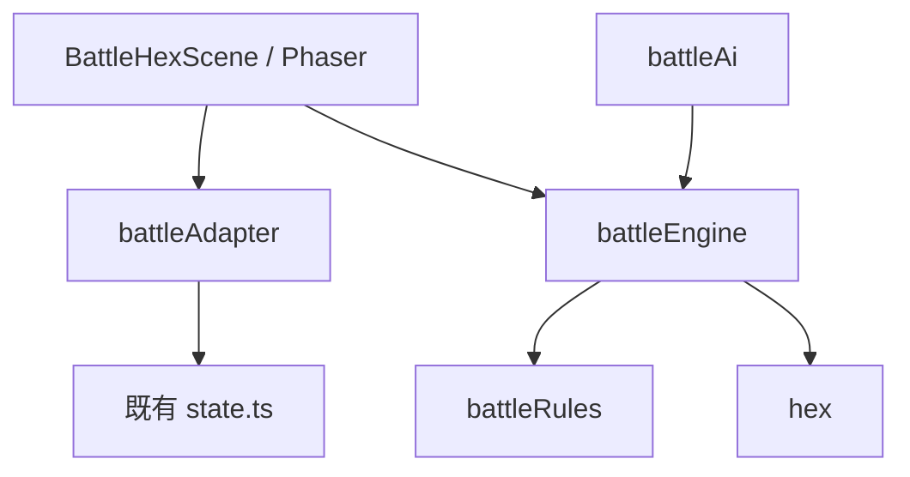

# 《大航海福爾摩沙》六角格回合制海戰架構與低階模型施工規格

> 本文件是下一版海戰的獨立討論草案，不直接覆蓋《遊戲建構書》§5-5。
> 老闆確認規則後，才把定案內容同步回建構書與 `memory.md`。
> 本案口語稱「六宮格」，技術與文件一律寫成 **六角格（hex grid）**；它代表六邊形網格，不是固定只有六個格子。

---

## 〇、先講結論

建議第一版採用：

- **11 欄 × 7 列、平頂六角格**戰場，畫面固定在 `1280×720` 邏輯尺寸內。
- 玩家與敵方各最多 5 艘船，每艘船占 1 格。
- 回合順序為「玩家全隊 → 敵方全隊 → 回合結算」。
- 每艘船每回合可做：**移動一次＋主要行動一次**。
- 主要行動：側舷砲擊、接舷、修整、等待；撤退是移動到己方撤退邊界後執行。
- 船有 6 個朝向；移動後船首朝向最後一步方向。
- 大砲以左右側舷射界為主，接舷限相鄰格。
- 島嶼不可通行且阻擋砲線；淺灘降低大型船移動力。
- 第一版不做複雜風向、潮流、火攻與誘敵，但資料結構預留欄位。
- 舊 `BattleScene` 保留作回退；新系統另建 `BattleHexScene`，驗收完成後才切換正式入口。

這套做法比「每艘船輪流交錯行動」更容易理解，也比較適合手機、iPad 與國小五六年級玩家。

---

## 一、附件轉譯成遊戲需求

三張參考圖可拆成下列需求：

| 參考圖特徵 | 本案採用方式 |
|---|---|
| 六角格海域 | 平頂六角格，每格可放船或地形 |
| 多艘船排成艦隊 | 玩家現有旗艦＋僚艦各自成為一個戰鬥單位 |
| 敵我由顏色區分 | 玩家青綠框、敵方朱紅框；不可只靠顏色，另加旗幟與文字 |
| 可移動範圍高亮 | 選船後以青綠色顯示可移動格，選攻擊後以紅色顯示合法目標 |
| 島嶼與海岸 | 地形阻擋移動與砲線，形成繞行與伏擊空間 |
| 船體血量／資訊 | 船上方顯示簡短耐久條，詳細數值放右側資訊面板 |
| 大規模艦隊感 | 遊戲內仍限制最多 5 對 5，避免手機畫面過密與回合過長 |

### 不直接照搬的部分

- 不使用附件遊戲的圖像、UI、船隻或特效，只參考網格與資訊層級。
- 不做數十艘同場的大規模戰鬥；現有專案上限是 5 艘艦隊。
- 不讓畫面塞滿小字。手機版優先採「點船看資訊、點格預覽、再確認」的操作。

---

## 二、設計目標與非目標

### 2-1. 必須達成

1. 玩家能看懂船能走哪裡、能打誰、為什麼不能打。
2. 一場一般戰鬥目標 3～5 分鐘，最多 12 回合。
3. 旗艦、僚艦、船型、砲數、耐久、船帆、裝甲、砲種與夥伴能力都能反映在戰鬥中。
4. 手機與 iPad 可完全用單指操作；桌面保留滑鼠與鍵盤。
5. 主線決鬥、夥伴決鬥、商館海戰與隨機海盜仍走同一套戰鬥結果流程。
6. 戰敗仍遵守既有規則：損失部分金錢／貨物、回最近港口，不 Game Over。
7. 所有規則資料化，數值不得散落在 Phaser 場景。
8. 純規則引擎可在沒有 Phaser 畫面的情況下自動測試。

### 2-2. 第一版不做

- 即時制或同時下令。
- 3D 船模、物理碰撞、真實彈道。
- 每名水手各自作戰。
- 複雜天候、潮流與逐格風向計算。
- 多層高度、登島陸戰、港口攻城。
- PvP 或連線對戰。
- 戰鬥中永久新增船隻裝備欄位。

### 2-3. 後續擴充槽

- 風向：順風移動 +1、逆風轉向成本 +1。
- 火攻、誘敵：軍師職位解鎖。
- 煙霧、暴風、暗礁、漩渦等地圖效果。
- 歷史戰役專用地圖與部署。

（自動戰鬥原列於此；2026-07-12 老闆定案改納入第一版，見 §3-10 與 P6-2。）

---

## 三、核心回合規則（建議定案 v0.1）

### 3-1. 戰場

- 網格：平頂六角格（flat-top hex）。
- 預設大小：11 欄 × 7 列；允許資料檔另設 9×7 或 13×7，但第一版只驗 11×7。
- 座標：axial coordinate，使用 `(q, r)`，禁止以像素座標作規則判定。
- **座標語意（2026-07-12 小航修正定案）**：`battleMaps.json` 的地形格與部署格 (q,r) 是**視覺欄／列**座標；引擎與畫面讀入時必經 `hex.ts` 的 `offsetToAxial(col,row)` 轉為 axial，邊界判定用 `hexInMap`（欄列語意）。直接把欄列當 axial 畫圖會使戰場歪成平行四邊形，禁止。
- 每格地形：
  - `deep`：深海，正常通行。
  - `shallow`：淺灘，大型船額外消耗 1 移動點。
  - `land`：島嶼／陸地，不可通行且阻擋砲線。
  - `reef`：暗礁，第一版視為不可通行；後續可改成受損風險格。
- 玩家部署區在左側 2 欄，敵方部署區在右側 2 欄。
- 撤退邊界是玩家左邊界／敵方右邊界，不另放撤退按鈕讓玩家無條件瞬間消失。

### 3-2. 艦隊與船隻單位

- 玩家：`state.ship` 旗艦＋`state.escorts` 僚艦，最多 5 艘。
- 敵方：由遭遇資料依 tier 產生 1～5 艘，必有一艘旗艦。
- 每艘船至少包含：
  - 船型、陣營、是否旗艦。
  - 現在格 `(q,r)` 與朝向 `facing: 0..5`。
  - 耐久、最大耐久、砲數、水手、移動力。
  - 本回合是否已移動、是否已行動。
  - 狀態：正常、受創、投降、沉沒、撤退。
- 戰鬥中的水手數是暫存值：由全艦隊總水手依各船 `minCrew/maxCrew` 比例分配；戰後只把存活總數回寫 `state.crew`。
- 第一版不改存檔格式；格子、朝向、行動狀態只存在單場戰鬥記憶體。

### 3-3. 回合流程



每艘船一回合最多：

1. 移動 `0..movePoints` 格。
2. 執行 1 次主要行動。
3. 行動後鎖定，直到下一個己方回合。

允許「先行動、後不移動」，不允許「攻擊後再移動」，避免打帶跑過強且降低 UI 複雜度。

### 3-4. 移動力

第一版用離散表，不直接拿浮點速度乘倍率：

| 最終航速（含船帆） | 基礎移動力 |
|---|---:|
| `< 0.95` | 2 |
| `0.95～1.09` | 3 |
| `>= 1.10` | 4 |

規則：

- 深海每格 1 點。
- 淺灘：小／中型船 1 點，大型船 2 點。
- 不可穿過任何船隻；可以繞過友軍。
- 移動最後一步的方向會成為船首朝向。
- 原地轉向：可免費選擇相鄰的 6 個方向之一，但原地轉向後本回合移動力 -1；第一版 UI 僅在選取船後提供左右轉按鈕。
- 可移動範圍使用 BFS／Dijkstra 計算，不准用畫面距離猜測。

### 3-5. 砲擊

- 砲擊是主要行動，每艘船每回合最多一次。
- 預設砲種：射程 1～2 格。
- 輕型佛朗機砲：射程 1～2，命中穩定。
- 散彈砲：射程 1，耐久傷害較低，但接舷壓制較強。
- 重型紅夷砲：射程 2～3，近距離命中較差、遠距威力高。
- 射界：以船首方向為基準，只能攻擊左、右側舷扇形；船首與船尾方向是死角。
- 島嶼／陸地阻擋砲線；船隻不阻擋砲線，以免 5 對 5 過度卡死。
- 點選目標前顯示：預估傷害範圍、射程修正、是否側舷、阻擋原因。

建議初版傷害公式集中在單一函式：

```text
base = cannons × 6
damage = round(base × cannonPower × captainGunnerMod × rangeMod × armorMod × random(0.90, 1.10))
```

初版修正：

- 射程 1：`rangeMod = 1.00`
- 射程 2：`rangeMod = 0.90`
- 射程 3：`rangeMod = 0.80`
- 目標船首／船尾被擊中：`armorMod` 再乘 1.10（代表較難用側舷承受）。
- 最低傷害 1。
- 隨機值必須由可注入亂數產生器提供，測試時固定 seed；禁止直接在規則引擎散用 `Math.random()`。

### 3-6. 接舷

- 兩船必須位於相鄰格。
- 接舷不要求側舷射界，但攻擊者本回合必須尚未執行主要行動。
- 戰力沿用現有概念：水手＋武器＋`boardBonus()`＋散彈壓制。
- 不直接一次決定全艦隊勝敗，只作用於目標船：
  - 攻方明顯勝出：目標船投降／被俘。
  - 勢均力敵：雙方水手減少，目標船保留。
  - 攻方失敗：攻方水手減少並增加疲勞。
- 敵旗艦被俘視為勝利；普通敵船被俘後退出戰場並增加戰利品倍率。
- 文字保持不血腥，使用「掛彩、退下、投降、被俘」。

### 3-7. 修整與等待

- `repair` 修整：回復最大耐久 5%，最低 3、最高 12；每艘船每場最多一次。
- `wait` 等待：不產生效果，用於保留位置並完成本回合。
- 第一版不做補彈，大砲次數不限。

### 3-8. 勝利、戰敗與回合上限

勝利任一成立：

- 敵旗艦沉沒。
- 敵旗艦投降／被俘。
- 所有敵船沉沒、投降或撤退。

戰敗任一成立：

- 我方旗艦耐久歸零。
- 我方旗艦被接舷擊敗。
- 我方所有船撤退；視為成功脫離，不算戰敗但沒有獎勵。

第 12 回合結束仍未分勝負：

- 比較雙方「旗艦耐久百分比＋存活船數×20」。
- 玩家高於敵方：敵人撤退，算普通勝利但戰利品减半。
- 玩家不高於敵方：玩家被迫撤退，不扣 30% 金錢，只增加疲勞。

### 3-9. 敵方 AI v1

AI 不做搜尋樹，採可預測的優先級：

1. 可擊沉玩家旗艦 → 砲擊玩家旗艦。
2. 可接舷且勝率 >= 65% → 接舷。
3. 有合法砲擊 → 選預估傷害最高目標。
4. 耐久低於 25% 且可撤退 → 朝撤退邊界移動。
5. 否則朝最近可攻擊玩家船的格子移動。
6. 無路可走 → 原地轉向或等待。

同分時固定依：旗艦優先 → 耐久較低 → 單位 id 字典序。禁止依陣列偶然順序決定，避免重播不一致。

### 3-10. 自動戰鬥（2026-07-12 老闆定案納入第一版）

- 玩家回合開始時提供「自動戰鬥」按鈕，啟用後由 AI 代打我方、加速播放，每回合開始可按「接手指揮」改回手動。
- **啟用門檻**：`我方戰力 ≥ 敵方戰力 × autoBattle.minAdvantageRatio`（初版 1.5，數值放 `battleRules.json`，試玩後可調）。
  - 老闆定案的兩個不可用情境（雙方戰力差距太小、敵方戰力遠大於我方）皆由此單一門檻涵蓋；比值不足時按鈕灰階並顯示「敵我戰力接近，需親自指揮」。
- 戰力評估為純函式 `sidePower(units, side)`：Σ（耐久＋砲數×砲種威力×基準傷害＋水手×0.5），旗艦權重 ×1.2；集中在 `battleRules`，Scene 不得重算。
- 自動戰鬥雙方都用 §3-9 的 AI 產生指令、走同一 engine 與 seed；結算與手動完全一致，不加成、不懲罰。
- 施工位置：P6 敵方 AI 完成後的 P6-2（見第八節）。

---

## 四、畫面與操作

### 4-1. 橫向版面

```text
┌──────────────────────────────────────────────────────────────┐
│ 回合 3／12   玩家回合   尚可行動 3 艘          [結束回合] │
├──────────────────────────────────────────────┬───────────────┤
│                                              │ 選中船資訊    │
│              六角格戰場                     │ 耐久／水手    │
│       我方（青綠） ←→ 敵方（朱紅）          │ 移動／射程    │
│                                              │ 狀態與預估    │
├──────────────────────────────────────────────┴───────────────┤
│ [左轉] [右轉] [砲擊] [接舷] [修整] [等待]      戰報一行   │
└──────────────────────────────────────────────────────────────┘
```

- 戰場約占 75%，資訊面板約占 25%。
- 手機橫向時資訊面板可收合成底部抽屜。
- 所有主要觸控目標至少 44 CSS px。
- 同一時間只顯示當前步驟所需按鈕，避免所有指令一起亮。

### 4-2. 單指操作流程

1. 點我方船：選取，顯示可移動格。
2. 點可移動格：只預覽路徑，不立即扣行動。
3. 點「確認移動」或再次點目的格：執行移動。
4. 顯示合法行動；點「砲擊」後只亮合法敵船。
5. 點敵船：顯示預估，不立即開火。
6. 點「確認攻擊」：執行動畫與傷害。

取消規則：

- 移動確認前可點取消回到原位。
- 移動確認後不能復原，只能選主要行動。
- 攻擊確認前可取消；確認後不可取消。
- UI 點擊必須阻止 pointer 穿透到格子。

### 4-3. 視覺語言

- 可移動格：青綠半透明。
- 合法砲擊目標：朱紅外框。
- 接舷目標：金色鎖鏈圖示。
- 已行動船：降低飽和度但仍可查看。
- 旗艦：旗幟＋皇冠／星標，不只靠船尺寸。
- 路徑：白色虛線箭頭。
- 砲線被島嶼擋住：紅色斷線＋「島嶼阻擋」文字。

---

## 五、資料與程式架構

### 5-1. 新增檔案（建議）

```text
src/
  battle/
    battleTypes.ts          # 純型別；不得 import Phaser
    hex.ts                  # 座標、鄰居、距離、像素換算
    battleRules.ts          # 移動、射界、傷害、接舷、勝敗
    battleEngine.ts         # 狀態機與指令套用；不得畫畫面
    battleAi.ts             # AI 優先級；只呼叫 engine/rules
    battleAdapter.ts        # GameState ↔ BattleState、戰後回寫
    battleConfig.ts         # 功能旗標與資料讀取
  scenes/
    BattleHexScene.ts       # Phaser 顯示、輸入、動畫
  data/
    battleRules.json        # 可調數值
    battleMaps.json         # 地形、部署區、撤退邊界
    battleEncounters.json   # tier／具名決鬥敵艦隊
tools/
  validate-battle-hex.mjs   # 結構、資料與入口檢查
  simulate-battle-hex.mjs   # 固定 seed 自動戰鬥
```

### 5-2. 禁止的依賴方向



- `hex.ts`、`battleRules.ts`、`battleEngine.ts`、`battleAi.ts` 不可 import Phaser。
- `state.ts` 不可 import `BattleHexScene`。
- `BattleHexScene` 不可自行重算傷害、移動範圍、勝敗或 AI。
- JSON 不可引用畫面像素位置；只存格座標。

### 5-3. 核心型別草案

```ts
type Side = 'player' | 'enemy';
type Terrain = 'deep' | 'shallow' | 'land' | 'reef';
type BattlePhase =
  | 'setup'
  | 'player_select'
  | 'player_move_preview'
  | 'player_action_select'
  | 'player_target_select'
  | 'animating'
  | 'enemy_turn'
  | 'round_end'
  | 'result';

interface Hex { q: number; r: number; }

interface BattleUnit {
  id: string;
  side: Side;
  shipTypeId: string;
  flagship: boolean;
  hex: Hex;
  facing: 0 | 1 | 2 | 3 | 4 | 5;
  hull: number;
  hullMax: number;
  cannons: number;
  crew: number;
  movePoints: number;
  moved: boolean;
  acted: boolean;
  repaired: boolean;
  status: 'active' | 'surrendered' | 'sunk' | 'retreated';
}

interface BattleState {
  version: 1;
  seed: number;
  round: number;
  maxRounds: number;
  activeSide: Side;
  phase: BattlePhase;
  mapId: string;
  units: BattleUnit[];
  selectedUnitId: string | null;
  winner: Side | 'draw' | null;
  resultReason: string | null;
  log: BattleLogEntry[];
}
```

### 5-4. 指令式引擎

畫面不可直接改 `BattleState`，只能送指令：

```ts
type BattleCommand =
  | { type: 'select'; unitId: string }
  | { type: 'move'; unitId: string; path: Hex[] }
  | { type: 'turn'; unitId: string; facing: 0|1|2|3|4|5 }
  | { type: 'cannon'; attackerId: string; targetId: string }
  | { type: 'board'; attackerId: string; targetId: string }
  | { type: 'repair'; unitId: string }
  | { type: 'retreat'; unitId: string }
  | { type: 'wait'; unitId: string }
  | { type: 'end_turn' };
```

`applyCommand(state, command, rng)` 回傳：

- 新的 `BattleState`。
- `BattleEvent[]`（移動、砲擊、受損、投降、勝敗等），供 Scene 播動畫。
- 錯誤時回傳穩定 error code，例如 `OUT_OF_RANGE`、`BLOCKED_LOS`、`ALREADY_ACTED`；UI 再把 code 翻成繁體中文。

### 5-5. 既有系統接點

必須沿用：

- `fleetShips()`：建立玩家單位。
- `cannonMod()`：船長／砲術長／船首像／砲種加成來源。
- `boardBonus()`、`weaponBoard()`、`reduceCrewLoss()`：接舷來源。
- `pendingStoryDuel()`、`pendingMateDuel()`：具名敵人與 tier。
- `completeStoryDuel()`、`completeMateDuel()`、`updateQuestProgress()`：勝利後任務鎖存。
- `addReputation()`、`addXp()`、`levelUpMessage()`：獎勵。
- `saveGame()`：戰後存檔。

#### 現有聚合公式的拆分警告

現行海戰把全艦隊視為一個單位，部分 helper 已混合「全隊能力」與「旗艦裝備」。新海戰不可對每艘船直接重複呼叫：

- `cannonMod(state)` 同時含船長／砲術長等全隊加成，以及**旗艦**船首像與砲種倍率。
- `boardBonus(state)` 同時含統率／武勇等全隊加成，以及**旗艦**散彈砲壓制。
- `fleetHullMax(state)` 的額外裝甲加成目前只取旗艦。
- `damageFleet(state,dmg)` 會按全隊比例分攤傷害；新海戰是指定單船受損，禁止使用。

P2／P7 必須拆成兩層，但保留舊 helper 的輸出不變：

1. 全隊層：船長能力、夥伴職位、人物武器／防具等，只計算一次並寫入 `BattleContext`。
2. 單船層：該 `PlayerShip` 自己的砲數、砲種、船首像、裝甲、船帆、耐久，只作用於該 `BattleUnit`。

正確作法是新增純函式並讓舊 `cannonMod()`／`boardBonus()` 組合它們；不可直接改舊函式語意，否則正式流程在功能旗標仍為 `false` 時就會回歸。

戰鬥期間只改 `BattleState`；不可每次中砲就立刻改 `GameState`。勝利、撤退或戰敗確認後，adapter 才一次回寫各玩家船耐久、總水手、疲勞與結算結果，避免重新整理或場景重啟留下半套狀態。

目前只有三個正式海戰入口，切換時只能改：

- `WorldMapScene.ts` 約第 825 行：商館海戰。
- `WorldMapScene.ts` 約第 972 行：主線／夥伴具名決鬥。
- `WorldMapScene.ts` 約第 991 行：隨機海盜。

不得讓三個入口各自組不同資料；統一呼叫 `battleSceneKey()` 與同一份 scene data。

### 5-6. 回退開關

```ts
export const USE_HEX_BATTLE = false;
export function battleSceneKey(): 'Battle' | 'BattleHex' {
  return USE_HEX_BATTLE ? 'BattleHex' : 'Battle';
}
```

- 開發期間預設 `false`，正式網站仍走舊海戰。
- P7 全回歸通過後才改成 `true`。
- 舊 `BattleScene.ts` 至少保留到新海戰正式站驗收完成，不可先刪。

---

## 六、敵艦與地圖資料

### 6-1. 遭遇資料原則

`battleEncounters.json` 依 encounter id 定義：

- 一般海盜 tier 1：1～2 艘；初版機率固定為 1 艘 80%、2 艘 20%。
- tier 2：2～3 艘；初版機率固定為 2 艘 60%、3 艘 40%。
- tier 3：3～4 艘；初版機率固定為 3 艘 40%、4 艘 60%。
- 具名主線／夥伴決鬥：1～5 艘，不隨機抽船數，可指定旗艦名稱與船型；大型戰役以 4～5 艘呈現。
- 玩家一般戰鬥必須把 `state.ship` 與每艘 `state.escorts` 一對一建立為戰鬥單位，不得再把全隊合併成一艘。
- 故事明確描述友軍艦隊、且玩家實際船數不足劇情編成時，可用臨時「故事友軍船」補到我方最多 5 艘；友軍須標記來源，只存在該場戰鬥，不寫入存檔、不成為戰利品，也不得蓋掉玩家自己的船。
- 各 tier 共用同一套合法 AI，不用故意犯錯區分難度；強度由船數、船型、耐久、砲數、水手、裝備與戰場地圖資料提升。

主線資料仍只存 `duel: {name,tier}`；adapter 用 tier 找預設編成。不要把完整艦隊陣列複製進 `story.json` 或 `mates.json`。

### 6-2. 地圖資料原則

第一版做 3 張通用地圖：

1. `open_sea`：開闊海域，教學與 tier 1。
2. `island_channel`：中央島嶼與兩側航道，tier 2。
3. `reef_passage`：淺灘／暗礁形成窄口，tier 3 與具名決鬥。

每張只存：尺寸、地形格、玩家／敵方部署格、撤退邊界。不得存船隻像素座標。

---

## 七、美術產線規劃（Codex）

### 7-1. 第一批必要素材

1. 六角格海面底紋：深海、淺灘、暗礁，各 1 張可平鋪材質。
2. 島嶼／礁石透明 cutout：至少 6 種輪廓。
3. 8 船型 × 6 朝向的戰鬥 sprite，透明背景。
4. 玩家／敵方旗幟與旗艦標記。
5. 選取框：可移動、合法攻擊、危險、已行動。
6. 砲擊、煙霧、水花、受損、投降白旗、接舷鎖鏈特效。
7. 海戰指令圖示：轉向、砲擊、接舷、修整、等待、結束回合。

### 7-2. 規格原則

- 船隻使用 V2 精緻 2D 手繪航海 RPG 風格，3/4 俯視。
- 先做每船型 1 張高解析 source，再產生 6 朝向；不可逐張任意生成造成船型漂移。
- 每一船型六方向必須共用船身比例、桅杆數、帆色與旗幟位置。
- runtime sprite 建議單格 `192×192` 或 `256×256`，實際顯示約 72～96 邏輯 px。
- source、runtime、review contact sheet、manifest、prompt 紀錄全部保留。
- 正式接入前先用程式幾何圖形／現有船圖作 placeholder，不能讓美術阻擋規則開發。
- 外部素材與自製素材照舊登錄 `assets/CREDITS.md`；不可使用附件遊戲或 KOEI 圖像作直接素材來源。

### 7-3. 美術驗收順序

1. 先驗 8 船型六方向 contact sheet。
2. 再驗單張船放入六角格的尺寸與辨識度。
3. 再驗 5 對 5 不重疊、旗艦可辨識。
4. 最後才接特效與 UI icon。

---

## 八、低階模型施工規格

> 每一階段只做指定範圍。沒有通過該階段驗收，不得進下一階段。
> 同一問題修兩輪仍失敗，停止、記錄現象與差異，不做第三輪猜修。

### 每段共通可玩性品質閘門（2026-07-11 老闆確認）

每個 P0～P9 段落完成後都必須依序通過以下關卡；任何一項失敗，該段視為未完成，不得進入下一段、不得切換正式流程：

1. 本段專屬 validator／固定案例全部通過。
2. 既有觸控、lazy load、UI、港町、主線、夥伴與地理 validators 全部通過。
3. `npm run build` 通過，TypeScript 與 Vite production build 均不得有 error。
4. 固定 `127.0.0.1:5173` 瀏覽器實測：標題畫面可見、Phaser canvas 建立、console 0 error；P3 起再加本段新功能的滑鼠與觸控操作案例。
5. 確認舊 `BattleScene` 與 v19 存檔回退路徑仍可用；P7 前正式入口不得指向 `BattleHexScene`。
6. 只提交本段允許的檔案；commit＋push 後等待 Pages workflow success，若部署失敗則該段不得標完成。

基準線記錄：2026-07-11 P0 開工前，既有 8 組 validators、406 modules production build、標題畫面與 console 0 error 均已通過。

### 共通開工讀取順序

每次必讀：

1. `AGENTS.md`
2. `status.md`
3. `log.md` 最新 5 筆
4. `memory.md`
5. 本文件
6. `2026-07-05_開發工作規範_防閉環迭代機制.md`
7. 本階段允許修改的現有程式

### 共通禁令

- 不先刪或大改舊 `BattleScene.ts`。
- 不改存檔版本 v19，除非獨立提案獲准。
- 不改 `story.json`、`mates.json` 的既有任務結構。
- 不改交易、探索、港町、世界地圖移動規則。
- 不在 Scene 內寫第二套傷害／移動／AI 公式。
- 不用像素距離判斷六角格規則。
- 不讓 AI 直接修改狀態，AI 只能產生合法 `BattleCommand`。
- 不把附件圖片放進正式素材。
- 不在一個 commit 同時做規則、UI、美術與資料大改。
- Scene 一律以 `BASE_W`／`BASE_H` 排版、文字一律 `textStyle()`；相機由 main.ts 超取樣 hook 統一管理，禁止在場景自設 zoom／origin（memory 2026-06-25 鐵則）。
- 正式素材（約 50.76 MB）一律由 `BattleHexScene.preload()` 按需載入並保留 fallback；禁止加回 BootScene 預載（M5-8b 鐵則）；素材接入後必跑 `node tools/validate-lazy-assets.mjs`。
- 開發預覽入口：P3～P6 統一 `?hexmap=1`／`?hexmap=<地圖id>`（BootScene，無參數時正式流程不變）；P7 整合起改用 `?battle=hex`。

### P0：規格凍結與骨架

允許新增：型別檔、空 validator、空 JSON schema／初始資料。

完成條件：

- 專案可 build。
- JSON 可解析。
- `BattleHexScene` 尚未註冊、正式流程完全不變。
- validator 能檢查 3 張地圖 id 唯一、格座標不重複、部署格不是陸地。

建議 commit：`功能: 建立六角格海戰資料與型別骨架`

### P1：純六角格數學

只做 `hex.ts` 與測試／validator：

- 6 鄰居。
- hex distance。
- axial ↔ pixel。
- pixel → 最近 hex。
- 地圖邊界。
- line drawing（砲線）。

完成條件：固定案例全部通過；不得碰 Phaser Scene。

建議 commit：`功能: 完成六角格座標與路徑基礎`

### P2：純規則引擎

只做 `battleRules.ts`、`battleEngine.ts`：

- 合法移動範圍。
- 路徑成本。
- 側舷射界與 LOS。
- 指令驗證。
- 砲擊、接舷、修整、撤退、等待。
- 回合切換與勝敗。

完成條件：

- 固定 seed 模擬可重播得到相同結果。
- 所有非法指令回穩定 error code，狀態不變。
- 12 回合一定能結算。
- 不 import Phaser。

建議 commit：`功能: 完成六角格海戰純規則引擎`

### P3：戰場顯示

新增並註冊 `BattleHexScene`，但功能旗標仍為 `false`：

- 畫 11×7 格。
- 畫 3 種地圖。
- 顯示 placeholder 船、旗艦、耐久條。
- 點格能正確顯示 `(q,r)`。

完成條件：桌面、手機橫向、iPad 橫向不裁切；console 0 error。

建議 commit：`功能: 建立六角格海戰場景與地圖顯示`

### P4：玩家移動與選取

- 選船、移動範圍、路徑預覽、確認／取消。
- 船首方向、左右轉。
- UI 防 pointer 穿透。

完成條件：

- 不可走陸地、暗礁、船隻占用格。
- 淺灘成本正確。
- 移動前可取消，確認後不可回復。
- 桌面滑鼠與單指觸控都能操作。

建議 commit：`功能: 接入六角格海戰移動與觸控`

### P5：砲擊、接舷與結果事件

- 只由 engine 回傳事件，Scene 播 placeholder 動畫。
- 顯示預估傷害與不能攻擊原因。
- 投降、沉沒、修整、回合結算。

完成條件：規則測試與畫面數值一致；不得在 Scene 重算。

建議 commit：`功能: 接入海戰砲擊接舷與勝敗`

### P6：敵方 AI

- 依 §3-9 優先級產生命令。
- 每次命令先經 engine 驗證。
- AI 無合法動作時等待，不可卡死。

完成條件：至少 100 場固定 seed 模擬無死循環、無非法狀態、全部 12 回合內結算。

建議 commit：`功能: 完成六角格海戰敵方AI`

### P6-2：自動戰鬥（依 §3-10，2026-07-12 定案）

- `battleRules` 新增 `sidePower()` 與 `battleRules.json` 的 `autoBattle.minAdvantageRatio`；`battleAi` 供雙方使用。
- Scene 加「自動戰鬥」按鈕：門檻不足時停用並顯示原因；執行時加速播放事件，每回合開始可「接手指揮」。

完成條件：

- 門檻兩側（可用／不可用）固定案例測試通過。
- 固定 seed 自動戰鬥可完整重播。
- 接手後手動流程正常、結算與手動一致。

建議 commit：`功能: 加入六角格海戰自動戰鬥`

### P7：既有專案整合

- adapter 建立玩家／敵人單位與戰後回寫。
- **P7 開工阻斷閘門（2026-07-13 老闆定案）**：先完成並驗證 §6-1 的玩家實際艦隊一對一、tier 1／2／3 船數機率、具名大型戰役固定編成與臨時故事友軍；任一項仍使用 P3～P6 固定 5 對 5 展示資料時不得切正式入口。
- 三個 WorldMap 海戰入口改呼叫 `battleSceneKey()`。
- 任務、決鬥、聲望、經驗、戰利品、戰敗送回港口全部回歸。
- 先用 `?battle=hex` 或 dev flag 驗，不立刻切正式預設。

完成條件：

- 一般海盜、商館任務、主線決鬥、夥伴決鬥各通過一次。
- 固定 seed 驗證 tier 1／2／3 船數分布只落在核准範圍，且玩家擁有 1～5 艘時建立的玩家單位數完全一致；具名大型戰役與故事友軍另有固定案例。
- 舊 v19 存檔可讀。
- 勝利後任務完成；逃跑不完成；戰敗回最近港口。
- 既有舊 Battle 仍可回退。

建議 commit：`功能: 整合六角格海戰任務與存檔流程`

### P8：正式美術

- 依第七節逐批生成、切片、manifest、CREDITS、接入。
- 每批先 contact sheet 驗收，不可一次生成全部後直接接入。
- 材質缺失必須 fallback，不得黑屏。

建議每批獨立 commit，例如：`素材: 加入六角格海戰船隻六方向素材`

### P9：總驗收與切換

必跑：

```text
node tools/validate-battle-hex.mjs
node tools/simulate-battle-hex.mjs --runs 100
node tools/validate-touch-controls.mjs
node tools/validate-lazy-assets.mjs
node tools/validate-ui-consistency.mjs
node tools/validate-story-data.mjs
node tools/validate-mates-data.mjs
npm run build
```

人工矩陣：桌面 Chrome／Edge、手機、iPad；各驗一般海盜、任務、具名決鬥。

全部通過後才：

1. `USE_HEX_BATTLE = true`。
2. 更新《遊戲建構書》§5-5。
3. 更新 `status.md`、`memory.md`、prepend `log.md`。
4. commit＋push。
5. 等 Pages workflow success。
6. 正式站再驗一次入口、主程式、海戰完整流程。

---

## 九、驗收清單

### 規則

- [ ] 六角格鄰居、距離、路徑、砲線正確。
- [ ] 每船每回合最多移動一次＋主要行動一次。
- [ ] 側舷射界、島嶼阻擋與砲種射程正確。
- [ ] 接舷只作用於相鄰單船。
- [ ] 旗艦沉沒／投降正確結束戰鬥。
- [ ] 12 回合上限必定結算。

### 專案整合

- [ ] 旗艦＋僚艦最多 5 艘正確轉為單位。
- [ ] 戰後耐久與水手正確回寫，不改 v19 schema。
- [ ] 三種任務／遭遇入口共用同一 adapter。
- [ ] 勝利、撤退、戰敗的獎勵與任務結果正確。
- [ ] 舊 Battle 可一鍵回退。

### UI／裝置

- [ ] 玩家永遠知道目前輪到誰、還有幾艘可動。
- [ ] 移動與攻擊都有預覽＋確認。
- [ ] 手機／iPad 單指可完整打完一場。
- [ ] 觸控目標至少 44 CSS px。
- [ ] 5 對 5 仍能辨識旗艦、敵我與耐久。
- [ ] 一般戰鬥 3～5 分鐘。

### 美術與版權

- [ ] 8 船型六方向外觀一致。
- [ ] 地形、格線、船與特效層級清楚。
- [ ] 附件只作概念參考，未使用原圖素材。
- [ ] source／runtime／manifest／prompt／review 完整。
- [ ] `assets/CREDITS.md` 已同步。

---

## 十、設計決策（2026-07-12 老闆定案）

1. **回合方式**：玩家全隊 → 敵方全隊（採建議）。
2. **方向與側舷**：第一版就做 6 朝向＋側舷射界（採建議）。
3. **戰場大小**：11×7（採建議）。
4. **接舷結果**：俘獲普通敵船只換戰利品（採建議）。
5. **回合上限**：12 回合（採建議）。
6. **第一版地形**：深海／淺灘／島嶼／暗礁（採建議）。
7. **自動戰鬥**：**第一版納入**，但有啟用門檻——只有我方戰力明顯優於敵方時才能啟動；**雙方戰力差距太小、或敵方戰力遠大於我方時，自動戰鬥選項不可用**。設計細節見 §3-10，施工排在 P6-2。

> 定案內容尚未寫回《遊戲建構書》§5-5；依 P9 流程於正式切換時同步。

---

## 十一、Codex 對這個方向的看法

這個改版值得做。現行海戰只有三個按鈕，船型、僚艦與機動空間沒有真正呈現；六角格能讓「快船繞側面、大船守航道、島嶼遮砲、接舷搶旗艦」變成玩家看得見的選擇，也能讓 8 種船型與後續美術更有價值。

最大風險不是六角格數學，而是一次加入太多航海規則。第一版應先把移動、朝向、側舷、地形、砲擊、接舷與 AI 做穩；風向、火攻、誘敵、自動戰鬥都等核心流程在手機與 iPad 驗收後再加。
